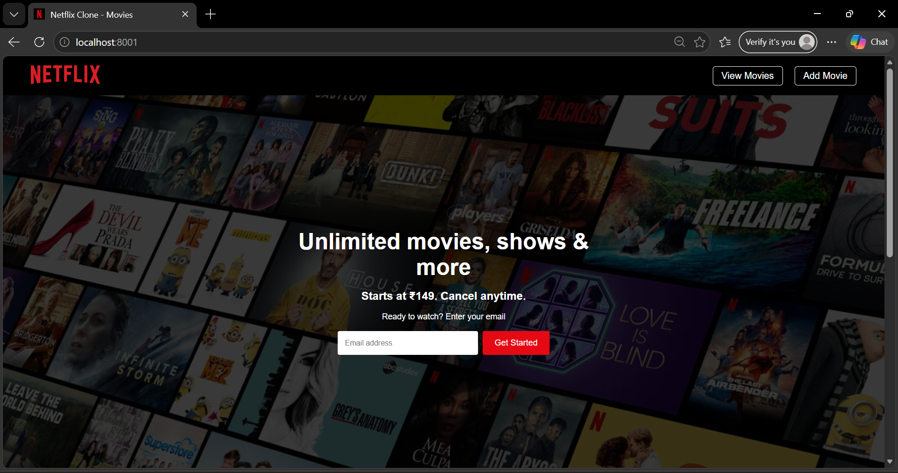
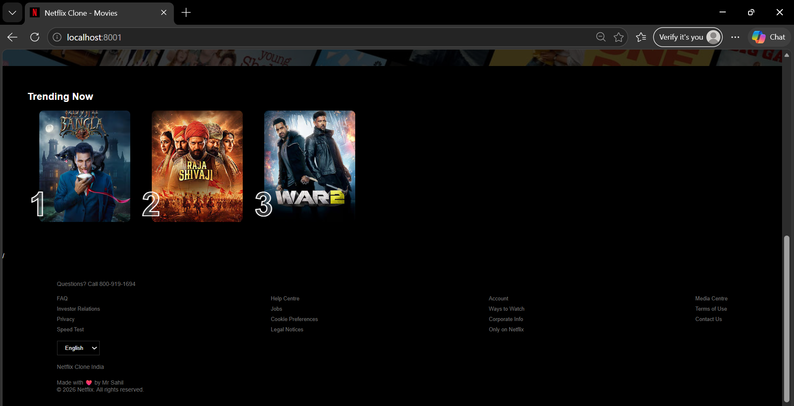
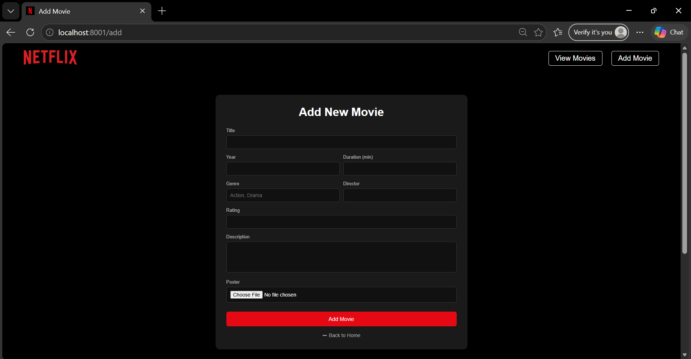
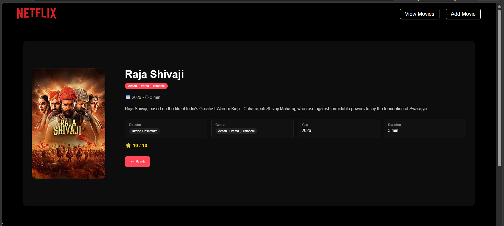
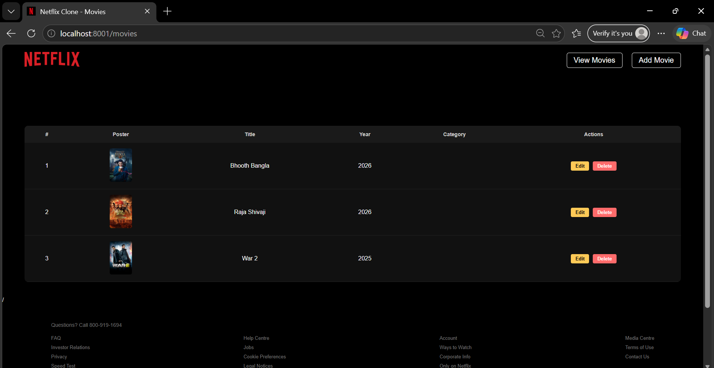
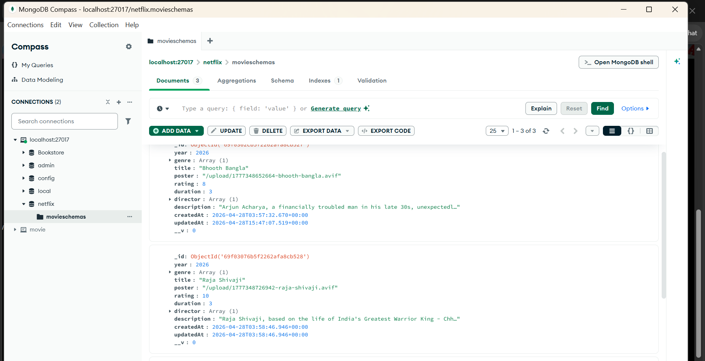

# 🎬 Netflix Clone Web App

A simple Netflix-style movie web application built using Node.js, Express, MongoDB, and EJS.
Users can add movies, upload posters, and view movie details.

---

## 🚀 Features

* Add new movie
* Upload movie poster
* View all movies
* View single movie details
* Delete movie
* Simple UI like Netflix

---

## 🛠️ Tech Stack

* Node.js
* Express.js
* MongoDB (Mongoose)
* EJS
* Multer

---

## 📁 Folder Structure

netflix-clone/
│
├── config/
│   └── db.js
├── controllers/
│   └── movieController.js
├── model/
│   └── movie.js
├── routes/
│   └── movieRoutes.js
├── views/
│   ├── add-movie.ejs
│   ├── edit-movie.ejs
│   ├── footer.ejs
│   ├── header.ejs
│   ├── index.ejs
│   ├── movies.ejs
│   └── view.ejs
├── public/
│   └── assets/
├── upload/
├── index.js
└── package.json

---

## ⚙️ Installation

1. Open terminal
2. Go to project folder

cd netflix-clone

3. Install dependencies

npm install

---

## ▶️ Run Project

node index.js

OR

npm start

---

## 🌐 Open in Browser

http://localhost:8001

---

## 📌 Routes

/ → Home
/movies → All movies
/add → Add movie page
/view/:id → View movie
/api/movies/add → Add movie (POST)
/api/movies/delete/:id → Delete movie

---

## output

     

## 📦 Requirements

* Node.js installed
* MongoDB running
* upload folder present

---

## 👨‍💻 Author

Sahil Nerpagar

---

## 📌 Note

This project is created for learning purpose and beginner practice.
